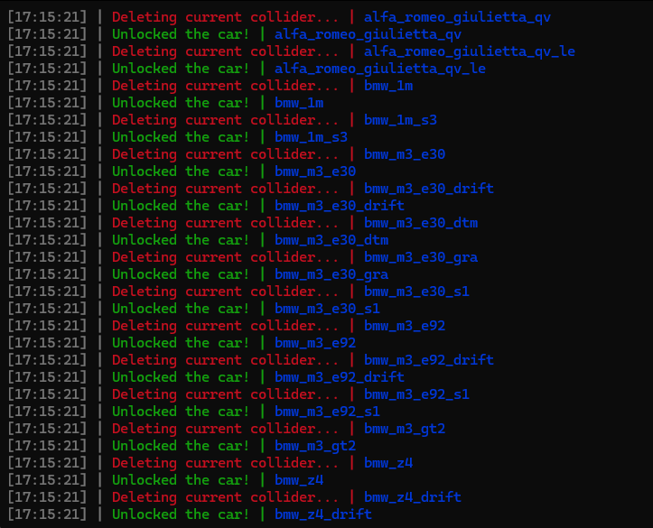

# Assetto Corsa > Unlock All Cars

## 💻 Preview :

## 🔥 Features
- Unlocks all cars
- Probably cant get patched
- Doesnt cause any errors (tested myself)

## ✍️ Usage
1. Download Python (https://www.python.org/downloads/)
2. Run the "get every car" file (😱)

## ⚠️ DISCLAIMER
This github repo is for EDUCATIONAL PURPOSES ONLY. I am NOT under any responsibility if a problem occurs.

## 🗒️ NOTES

- Contact : n2vk on discord
- credits for radu for the readme!!!!
